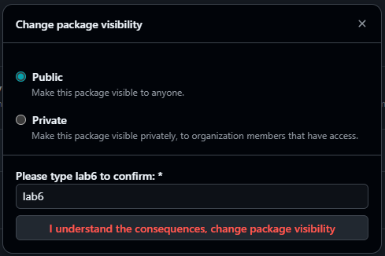
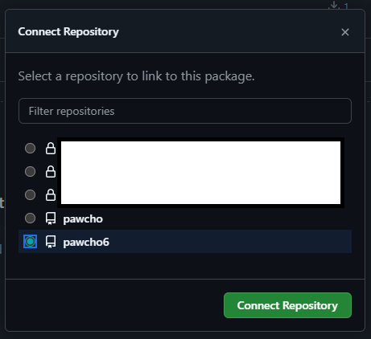
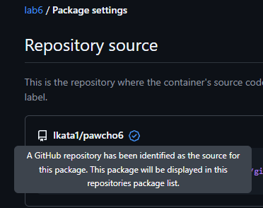

# Utworzenie repo
```
gh repo create --public --clone lkata1/pawcho6                # utworzenie pustego, publicznego repo i sklonowanie go na dysk
cd pawcho6                                                    # przejście do folderu z repozytorium
git submodule add https://github.com/lkata1/pawcho source     # dodanie powiązania z kodem lab5
vim Dockerfile                                                # uzupełnienie pliku
git add .                                                     # dodanie zmian do stage
git commit -m "wiadomość"                                     # utworzenie commita
git push origin master                                        # wypchnięcie commita do zdalnego repozytorium (serwer github)
```

# Zbudowanie obrazu
Celowo podaje ścieżke do klucza ssh zamiast socketu - wsl ma problem z poprawnym montowaniem go,\
ten sposób dodatkowo nie wymaga włączenia ssh-agent.
```
docker build\
    --no-cache\
    --push\
    --ssh default=$HOME/.ssh/gh_lab_ed25519\
    --build-arg VERSION=6.0.0\
    -t ghcr.io/lkata1/lab6:latest\
    git@github.com:lkata1/pawcho6.git

[+] Building 101.7s (20/20) FINISHED                                                                                                                     docker:desktop-linux
 => CACHED [internal] load git source git@github.com:lkata1/pawcho6.git                                                                                                  3.8s
 => resolve image config for docker-image://docker.io/docker/dockerfile:1.17                                                                                             0.8s
 => CACHED docker-image://docker.io/docker/dockerfile:1.17@sha256:38387523653efa0039f8e1c89bb74a30504e76ee9f565e25c9a09841f9427b05                                       0.0s
 => => resolve docker.io/docker/dockerfile:1.17@sha256:38387523653efa0039f8e1c89bb74a30504e76ee9f565e25c9a09841f9427b05                                                  0.0s
 => [internal] load git source git@github.com:lkata1/pawcho6.git                                                                                                         3.7s
 => [internal] load metadata for docker.io/oven/bun:1.3.0                                                                                                                0.7s
 => CACHED [build 1/7] FROM docker.io/oven/bun:1.3.0@sha256:00cccad6e9c66bbacc250851f689168606aaea551ac473e908bbcf00a5645025                                             0.0s
 => => resolve docker.io/oven/bun:1.3.0@sha256:00cccad6e9c66bbacc250851f689168606aaea551ac473e908bbcf00a5645025                                                          0.0s
 => CACHED [final 1/3] ADD --unpack=true https://dl-cdn.alpinelinux.org/alpine/v3.23/releases/x86_64/alpine-minirootfs-3.23.3-x86_64.tar.gz /                            0.3s
 => [build 2/7] RUN apt update && apt install -y git                                                                                                                    18.7s 
 => [final 1/3] ADD --unpack=true https://dl-cdn.alpinelinux.org/alpine/v3.23/releases/x86_64/alpine-minirootfs-3.23.3-x86_64.tar.gz /                                   0.2s
 => [final 2/3] RUN apk add gcompat libstdc++                                                                                                                            3.7s 
 => [build 3/7] RUN mkdir -p -m 0600 ~/.ssh && ssh-keyscan github.com >> ~/.ssh/known_hosts                                                                              2.0s
 => [build 4/7] RUN --mount=type=ssh git clone --recurse-submodules ssh://git@github.com/lkata1/pawcho6.git                                                              3.6s
 => [build 5/7] WORKDIR /home/bun/app/pawcho6/source/lab5                                                                                                                0.0s
 => [build 6/7] RUN bun install                                                                                                                                          1.8s
 => [build 7/7] RUN bun run build                                                                                                                                       10.2s
 => [final 3/3] COPY --from=build /home/bun/app/pawcho6/source/lab5/dist /                                                                                               0.3s
 => exporting to image                                                                                                                                                  51.6s
 => => exporting layers                                                                                                                                                  3.2s
 => => exporting manifest sha256:bf06e4eec6f322352dd6711ff8fff1de99efe52bd18f1cfa9d85bb38124f3473                                                                        0.0s
 => => exporting config sha256:cdff4eda173d837599029db813584f6338b8b39540280eeff0a60c18b320f610                                                                          0.0s
 => => exporting attestation manifest sha256:4933c7089bfee18608c4d47482d459aa3d13d37ebe6fb9fa67a931a09f531765                                                            0.0s
 => => exporting manifest list sha256:20329321d19ca2a5cba34aa8bb0baa12b169a38dbacd1523720cb0da6a427ea7                                                                   0.0s
 => => naming to ghcr.io/lkata1/lab6:latest                                                                                                                              0.0s
 => => unpacking to ghcr.io/lkata1/lab6:latest                                                                                                                           0.6s
 => => pushing layers                                                                                                                                                   45.9s
 => => pushing manifest for ghcr.io/lkata1/lab6:latest@sha256:20329321d19ca2a5cba34aa8bb0baa12b169a38dbacd1523720cb0da6a427ea7                                           1.9s
 => [auth] lkata1/lab6:pull,push token for ghcr.io                                                                                                                       0.0s
 => [auth] lkata1/lab6:pull,push lkata1/pawcho6:pull token for ghcr.io                                                                                                   0.0s
 => pushing ghcr.io/lkata1/lab6:latest with docker                                                                                                                       2.4s
 => => pushing layer 589002ba0eae                                                                                                                                        2.2s
 => => pushing layer c6ae8c580e19                                                                                                                                        2.2s
 => => pushing layer 3b1ab9291d66                                                                                                                                        2.2s
 => => pushing layer 24c8bb7ae93a                                                                                                                                        2.2s
```

# Włączenie kontenera
```
docker run --rm -it -p 80:80 ghcr.io/lkata1/lab6

ready
Prosty serwer HTTP, wersja 6.0.0
"STOP" aby zatrzymać
"health (0|1)" by zmienić stan zdrowia
>
```
Kontener się poprawnie włącza i w przeglądarce można zobaczyć stronę internetową

# Edycja ustawień gotowego obrazu
edycja z poziomu interfejsu internetowego, gh cli nie udostępnia takich funkcji
### Ustawienie widoczności 
\

### Połączenie z repozytorium
\

